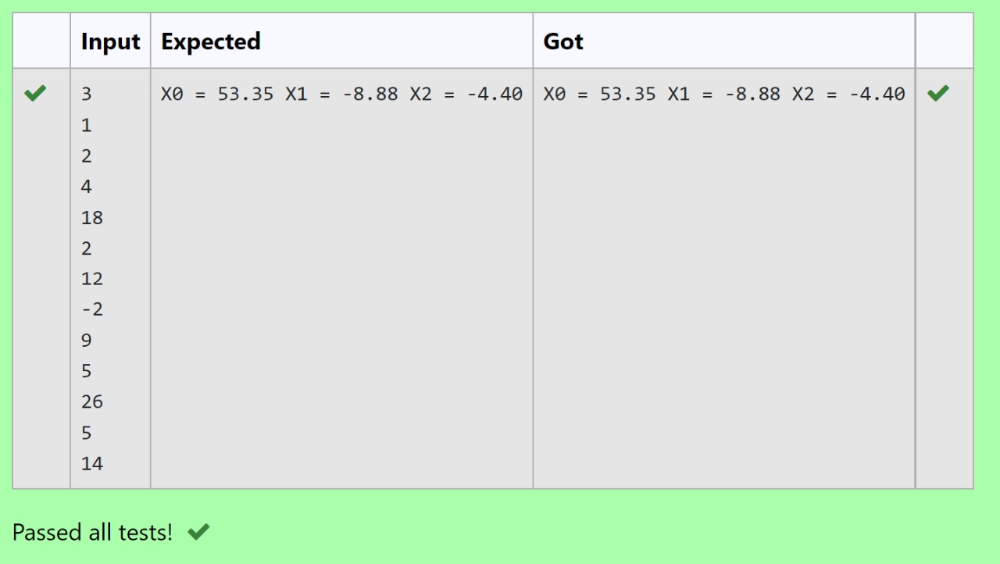

# Gaussian Elimination

## AIM:
To write a program to find the solution of a matrix using Gaussian Elimination.

## Equipments Required:
1. Hardware – PCs
2. Anaconda – Python 3.7 Installation / Moodle-Code Runner

## Algorithm:
### STEP 1:
import the numpymodule to use the built-in functions. for calculation 
### STEP 2:
import the sys module to use the built-in function 
### STEP 3:
get input from user for number of rows and add it by 1 for number for columns
### STEP 4:
using np.zeros()set the matrix as null matrix. 
### STEP 5:
using the loop gt input from the user for each element in the matrix
### STEP 6:
using for loop we can perform the elementary row operation and find the final matrix
### STEP 7:
print the value by solving the matrix using for loop ith 2 point pericision
### STEP 8:
end the program
## Program:


```
Program to find the solution of a matrix using Gaussian Elimination.
Developed by:Monisha T 
RegisterNumber: 21500314

import numpy as np
import sys
n = int(input())
a = np.zeros((n,n+1))
X = np.zeros(n)
for i in range(n):
    for j in range(n+1):
        a[i][j] = float(input())
for i in range(n):
    if a[i][i] == 0.0:
        sys.exit('Divide by zero detected')
    for j in range(i+1, n):
        ratio = a[j][i]/a[i][i]
        for k in range(n+1):
            a[j][k] = a[j][k] - ratio * a[i][k]
X[n-1] = a[n-1][n]/a[n-1][n-1]
for i in range(n-2,-1,-1):
    X[i] = a[i][n]
    for j in range(i+1,n):
        X[i] = X[i] - a[i][j]*X[j]
    X[i] = X[i]/a[i][i]
for i in range(n):
    print('X%d = %0.2f' %(i,X[i]), end = ' ')
```


## Output:



## Result:
Thus the program to find the solution of a matrix using Gaussian Elimination is written and verified using python programming.

